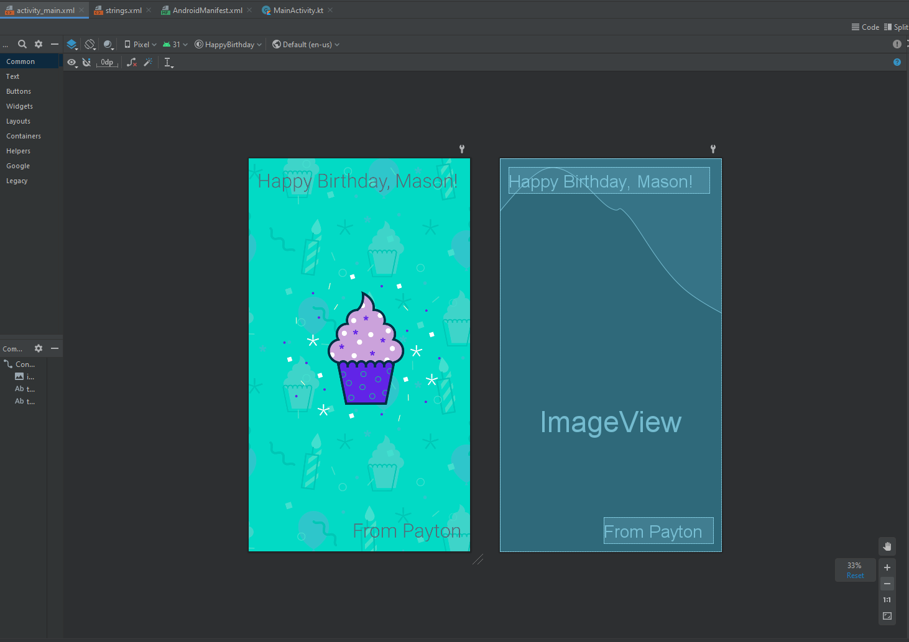
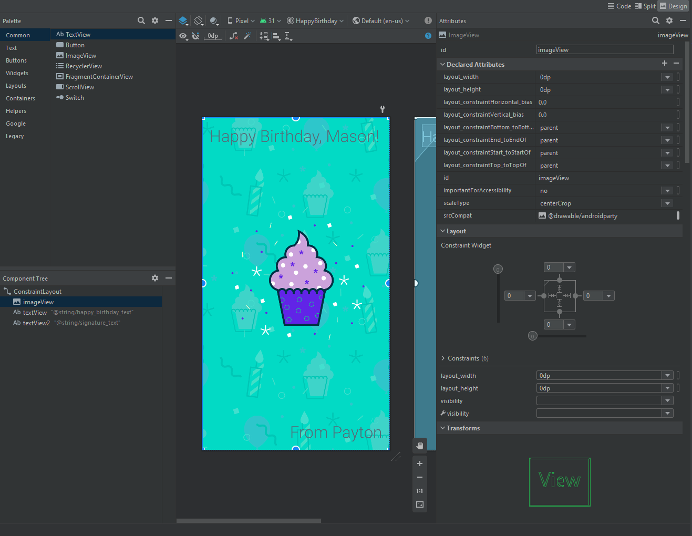
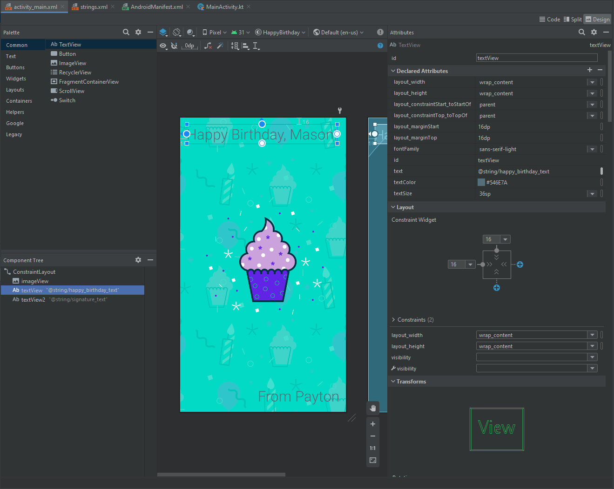

# Happy Birthday App - Android Studio
This is my first app using Android Studio. From this, I have learned about the Ui Interface of Android Studio as well as views (buttons, text, images, etc.) that can be applied to the Ui screen.

Views are very important in Android Studio since this is what the user sees. There can be text views (which shows text on the screen), images, buttons, and lots of other views. 

---
# What I learned

The above picture shows the makeup of a layout view that the user will see when they open up the app. It includes:
- Two text fields, one on the top and one on the bottom
- An image view, which is used for the background

This layout view is where the developer, me, will lay certain views for the user to see. 

The "Component Tree" includes these views in a hierarchy where the first view, the image, will be in the background while subsequent views will be on top of each other. 

## Constraints

Much like in XCode, constraints are used to accurately place a view to where it is generally in the same place on different devices and screens. Since we want the image to be in the background and take up the entire screen, we simply set the constriants to 0dp (display units) from each edge of the screen.

## Text Views

The text views are much like any other views where you can apply constraints to make it consistent across all devices. 

However, to change the text you can input the value in the *text* section. There will be a warning given out by Android Studio saying that the value is hardcoded and should use a @string resource. 

Doing a string resource will allow the code to be translated to other languages and will also allow the text to be used in multiple places. 

## Running the code
The code can be run through an emulator that Android Studio has provided or can be run through your own Android device!